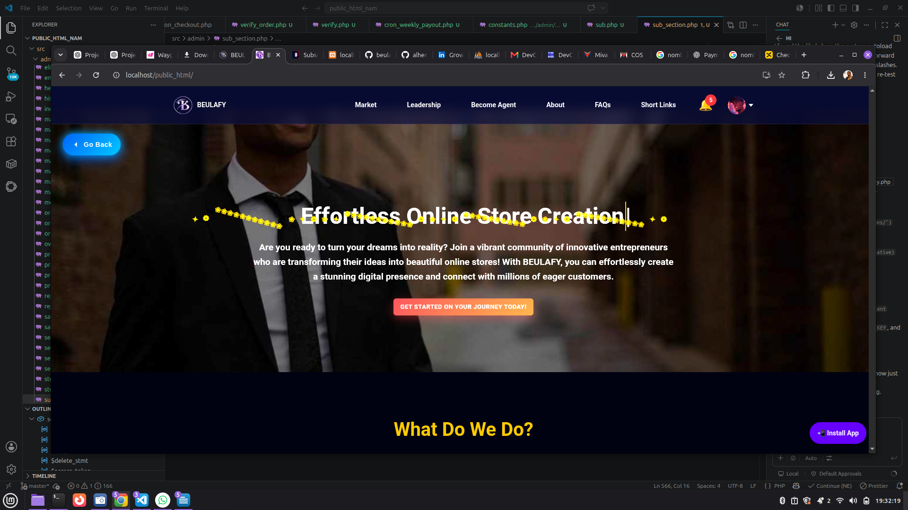
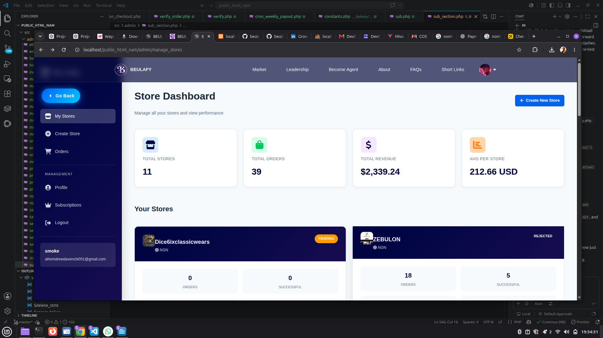
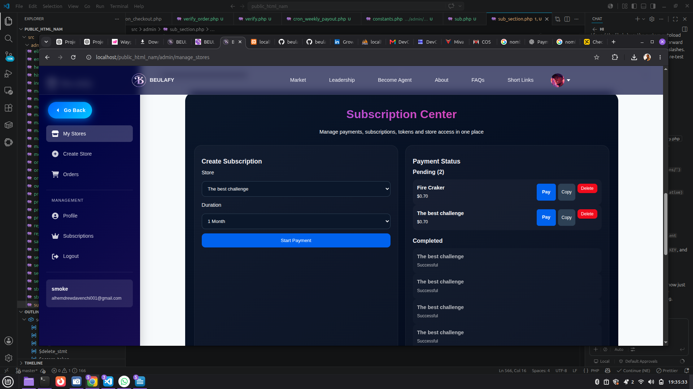
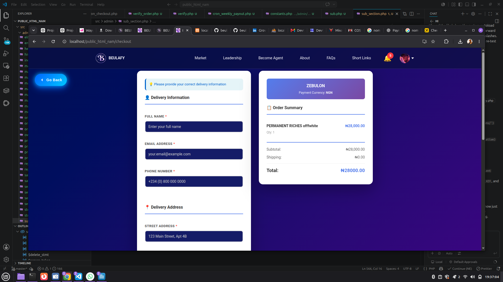
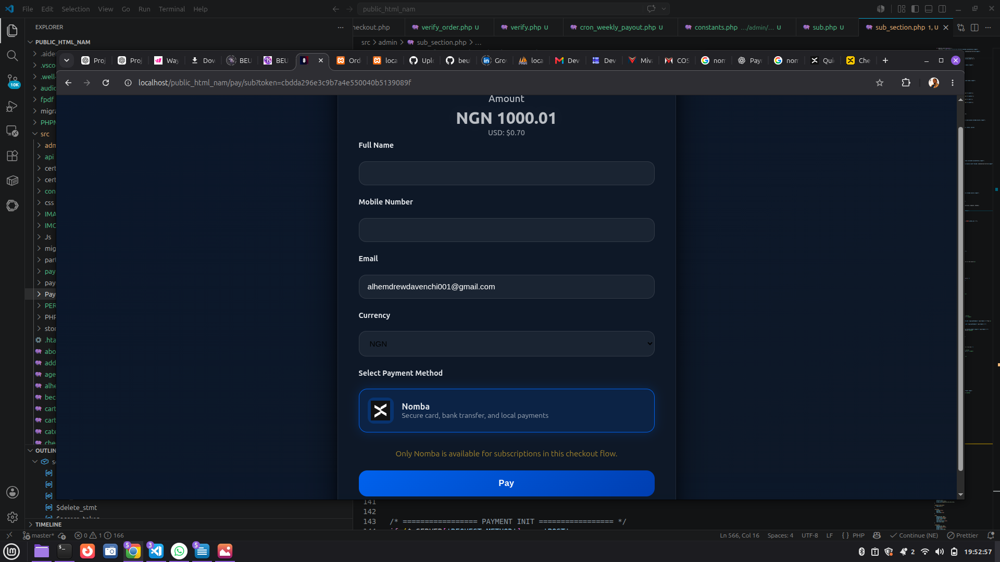
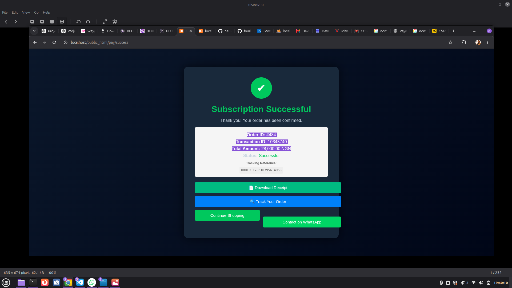
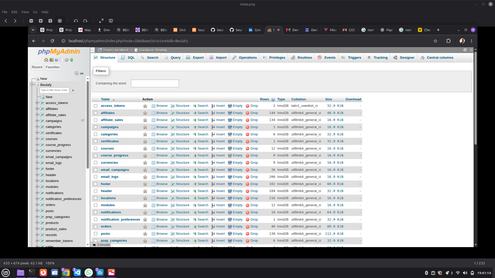
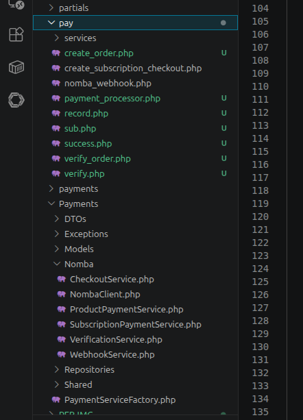
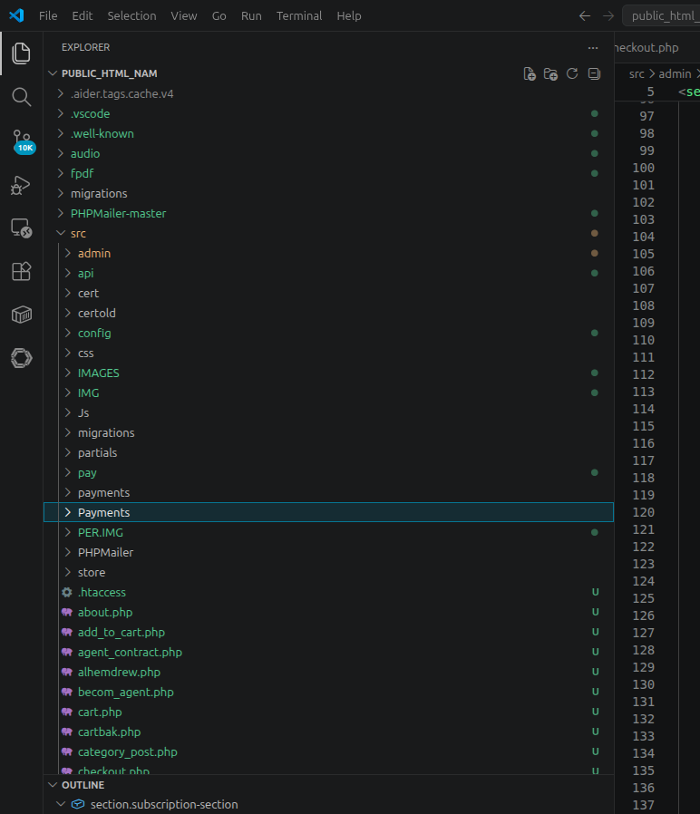

# Beulafy Commerce Platform — Powered by Nomba

> A modern multi-merchant commerce platform that enables businesses to create online stores, manage subscriptions, sell products, and receive secure payments through Nomba.

---

## Overview

Beulafy is a commerce platform designed to simplify online business operations for merchants. It provides everything needed to launch and manage an online store, while integrating Nomba as the exclusive payment infrastructure for subscriptions and customer purchases.

The project is being developed as part of the **DevCareer × Nomba Hackathon**, with a strong emphasis on secure payment processing, reliable transaction verification, and production-ready payment architecture.

---

## Current Features

* Merchant Authentication
* Business & Store Management
* Product Management
* Product Checkout
* Subscription Management
* Nomba Payment Integration
* Server-side Payment Verification
* Secure Callback Processing
* Webhook Processing
* Transaction Logging
* Order Management
* Notification System

---

## Technology Stack

* PHP 8
* MySQL
* JavaScript
* HTML5
* CSS3
* Nomba Payment APIs
* REST Architecture

---

## Payment Architecture

All payments are processed exclusively through **Nomba**.

The platform implements:

* Checkout Initialization
* Server-side Payment Verification
* Webhook Processing
* Transaction Reference Validation
* Amount Verification (Kobo)
* Replay Protection
* Audit Logging
* Secure Environment Variables
* Callback Validation

Client-side payment results are never trusted.

---

## Project Structure

```
src/
 ├── Payments/
 │    ├── Nomba/
 │    ├── Models/
 │    ├── DTOs/
 │    ├── Repositories/
 │    ├── Shared/
 │    └── Services/
 │
 ├── pay/
 ├── payments/
 ├── admin/
 └── config/
```

---

# Screenshots

## Homepage



---

## Merchant Dashboard



---

## Store Management



---

## Product Checkout



---

## Subscription Payment



---

## Nomba Checkout


---

## Payment Success



---

## Database Records



---

## Payment Architecture



---

## Project Structure



---

## Documentation

Additional documentation can be found in:

* STAGE_1_PROGRESS.md

---

## Status

Current Status:

**Stage 1 MVP**

Core commerce functionality is operational, while additional production hardening, testing, and deployment improvements are currently in progress.

---

## License

MIT License.
